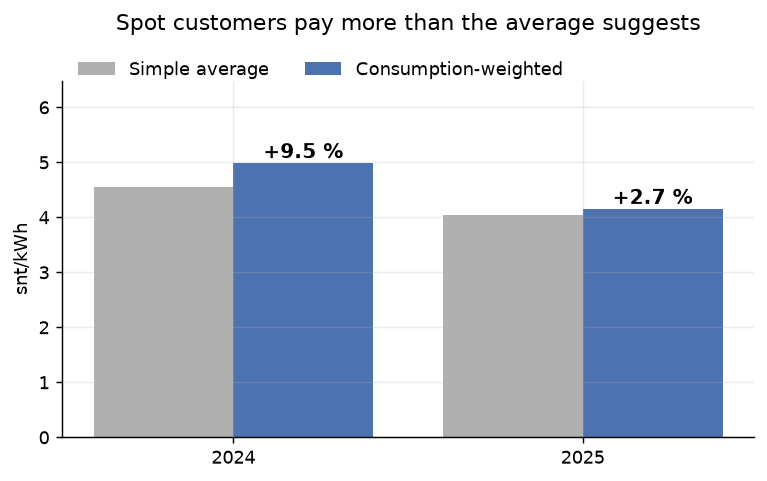
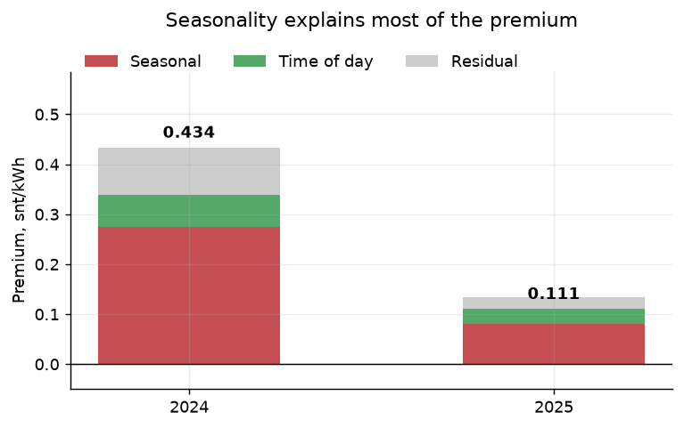
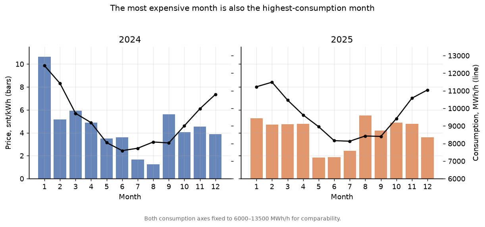
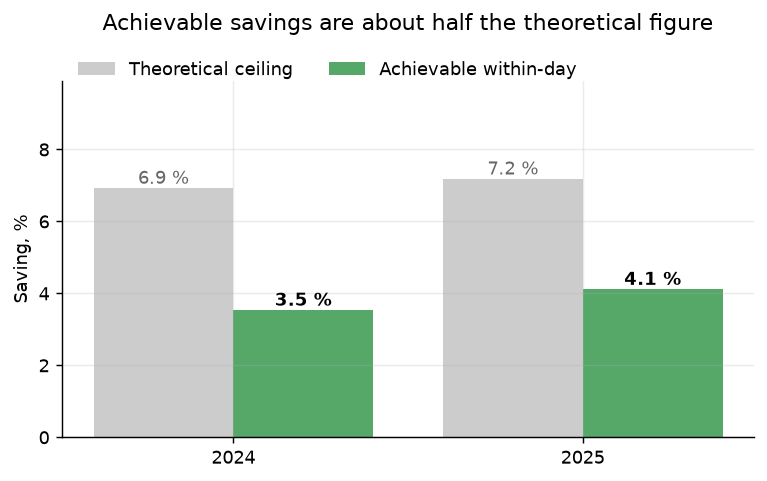

# Why did the electricity bill rise when the average price fell?

Root-cause analysis of consumption-weighted vs. simple average spot prices in Finland, 2024–2025.

**Answer in one line:** electricity bought at spot always costs more than the headline average suggests, because consumption peaks when prices peak. In 2024 the gap was **+9.5 %**; in 2025 only **+2.7 %**. The shrinkage is almost entirely a price story, not a behaviour story — consumption patterns were effectively identical across both years.

---

## The question

A company on a spot-price contract sees the reported average price fall year over year, but the bill does not fall proportionally. Which number is misleading, and by how much?

A simple average treats every hour as equally important. A consumption-weighted average asks what was actually paid. The difference between them is the premium a spot customer pays for *when* they use electricity.

## Data

| Source | Content | Licence |
|---|---|---|
| [sahkotin.fi](https://sahkotin.fi) (Pakastin Oy) | Hourly spot price, snt/kWh | Nord Pool data, non-commercial use |
| [Fingrid open data](https://data.fingrid.fi/) dataset 124 | Finnish electricity consumption, MWh/h | CC 4.0 BY |

17 541 hourly observations, 1.1.2024–31.12.2025.

## Scope and limitations

Five decisions that materially affect the numbers:

1. **Prices excl. VAT.** A company deducts VAT, and the Finnish rate changed in 9/2024 (24 % → 25.5 %). Including VAT would make part of the year-over-year change a tax artefact rather than a market signal.
2. **National consumption curve as a proxy** for a single company's load profile. A real profile would differ — the direction of the finding should hold, the magnitude would not.
3. **Quarter-hourly consumption aggregated to hours as a mean, not a sum.** MWh/h is power, not energy; summing four quarters would quadruple consumption without looking obviously wrong.
4. **From 1.10.2025 spot prices are quoted quarter-hourly.** The hourly price used here is sahkotin.fi's mean of those quarters — a derived figure, not a direct market price.
5. **One hour (6/2024) had no consumption data and was dropped.** Missing values were not interpolated: an invented consumption figure would feed straight into the weighted average.

## Method

1. Compute both averages per year: simple mean, and mean weighted by hourly consumption.
2. Decompose the premium into a time-of-day component, a seasonal component, and a residual.
3. Test the leading alternative explanation — that a single cold snap drives the result — by re-running without the most expensive 1 % of hours.
4. Cross-calculate: 2024 prices with the 2025 load profile and vice versa, to separate price effects from behaviour effects.
5. Quantify the recommendation as a load-shifting scenario.

## Findings

### 1. The premium is real in both years

| | Simple avg | Weighted avg | Premium |
|---|---|---|---|
| 2024 | 4.557 | 4.990 | **+9.5 %** |
| 2025 | 4.047 | 4.158 | **+2.7 %** |



### 2. It is structural, not a single cold snap

January 2024 saw a price spike to 189.6 snt/kWh, and 20 of the 50 most expensive hours in the dataset fall in that month. Removing the most expensive 1 % of hours:

| | Premium, all data | Premium, excl. top 1 % |
|---|---|---|
| 2024 | +9.5 % | **+7.5 %** |
| 2025 | +2.7 % | **+3.0 %** |

Extremes explain roughly a fifth of the 2024 premium. In 2025 removing them *increases* the premium slightly — the effect does not depend on spikes at all.

### 3. Seasonality dominates, not time of day

| | Premium (snt/kWh) | Hour-of-day | Month | Residual |
|---|---|---|---|---|
| 2024 | 0.434 | 0.065 (15 %) | **0.275 (63 %)** | 0.094 |
| 2025 | 0.111 | 0.053 (48 %) | **0.081 (73 %)** | −0.023 |



The mechanism is visible in the monthly table: January 2024 was 133 % above the annual average price *and* the highest-consumption month of the year (11.1 % of annual consumption). The most expensive month is also the month you use most.

The components do not sum exactly to the premium; the residual is day-level variation that neither coarse grouping captures. The negative 2025 residual means daily variation worked slightly in the consumer's favour that year.



### 4. Consumption behaviour did not change

Cross-calculating hourly profiles against hourly prices:

| | 2024 profile | 2025 profile |
|---|---|---|
| 2024 prices | 4.621 | 4.613 |
| 2025 prices | 4.108 | 4.100 |

Swapping the load profile moves the result by 0.008 snt/kWh. Swapping prices moves it by 0.51 — **sixty times more**. The entire year-over-year change comes from prices.

Price dispersion supports this: standard deviation fell 7.44 → 5.27 and the coefficient of variation 1.63 → 1.30. Notably the p90–p10 spread did *not* narrow (10.61 → 11.13) — ordinary daily variation persisted; what collapsed were the extremes and the winter–summer gap.

## Recommendation

Shifting 10 % of consumption from the most expensive quartile of hours to the cheapest:

| Scenario | 2024 | 2025 |
|---|---|---|
| Theoretical ceiling (quartiles across the whole year) | 6.9 % | 7.2 % |
| **Achievable (quartiles within each day)** | **3.5 %** | **4.1 %** |

The theoretical figure is not actionable: it implicitly shifts load from January to July. The within-day figure is what automation can actually deliver.

So:

- **Within-day load control is worth 3–4 % annually.** It is automatable and its value does not depend on whether the winter is expensive — note it delivers *more* in 2025 despite the far smaller total premium, because it targets the hour-of-day component, which was stable.
- **It does not address seasonal risk,** which was 63 % of the 2024 premium. That requires either price hedging for winter months or heating control across longer horizons.



## Uncertainties

- **Two years is not enough to say which winter is normal.** January 2024 ran 133 % above the annual average, January 2025 only 30 %. Seasonal risk is the dominant cost driver and the sample is too short to characterise its distribution.
- **The national consumption curve is not a company's curve.** A business with weekday-daytime load would see a different premium; the seasonal mechanism would remain.
- **August 2025 was 36 % above the annual average**, whereas August 2024 was 73 % below it. Price formation does not follow the seasonal pattern mechanically, and this analysis does not explain that exception.
- Correlation between price and consumption is not established here as causation in either direction; both are plausibly driven by temperature.

## Reproducing

```bash
git clone https://github.com/AleksanteriLohja/electricity-cost-root-cause-analysis.git
cd electricity-cost-root-cause-analysis
python -m venv .venv && .venv\Scripts\activate
pip install -r requirements.txt
```

Register for a free [Fingrid API key](https://data.fingrid.fi/) and place it in `.env`:

```
FINGRID_API_KEY=your_key_here
```

Then run `notebooks/analysis.ipynb` top to bottom (Restart → Run All). Raw data is cached to `data/raw/` as Parquet on first run and is not committed. The notebook's narrative cells are in Finnish.

## Data sources & licensing

- Consumption data: Fingrid open data (CC 4.0 BY) — https://data.fingrid.fi/
- Spot prices: sahkotin.fi (Pakastin Oy), price data owned by Nord Pool. Used for non-commercial purposes.

Code in this repository is licensed under MIT. The data licensing terms above apply separately to the source data.
